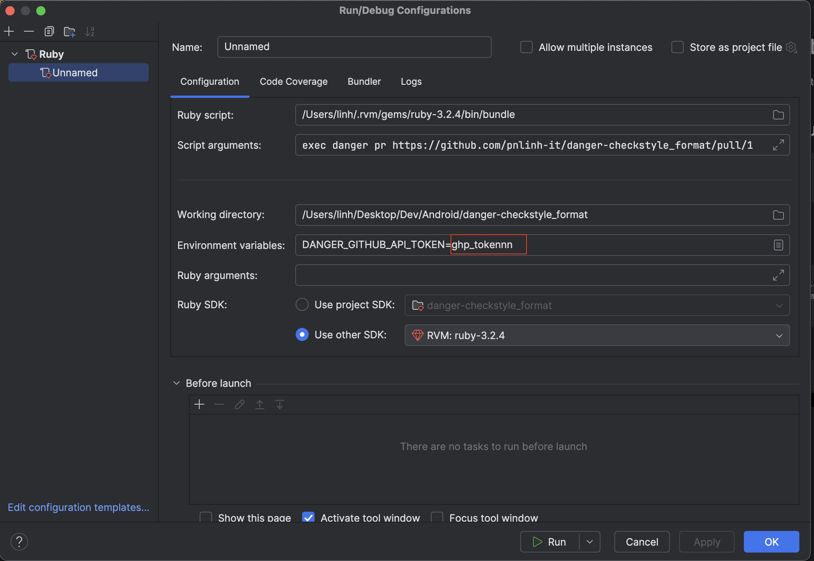

## Installation

```
source "https://rubygems.pkg.github.com/pnlinh-it" do
  gem "danger-checkstyle_format", "3.1.0"
end
```

## Usage

<blockquote>Parse the XML file, and let the plugin do your reporting

```ruby
checkstyle_format.base_path = Dir.pwd
checkstyle_format.report('app/build/reports/checkstyle/checkstyle.xml', inline_mode: false)
```

</blockquote>

<blockquote>Parse the XML text, and let the plugin do your reporting

```ruby
checkstyle_format.base_path = Dir.pwd
checkstyle_format.report_by_text '<?xml ...'
```

</blockquote>


## How to run with RubyMine

```shell
bundle config set --local path vendor/bundle 
bundle install

# OR
bundle install --path vendor/bundle
```

Config Run/Debug Configurations:
- Add value for `DANGER_GITHUB_API_TOKEN`

```
Ruby script: /Users/linh/.rvm/gems/ruby-3.2.4/bin/bundle
Script arguments: exec danger pr https://github.com/pnlinh-it/danger-checkstyle_format/pull/1
Working directory: /Users/linh/Desktop/Dev/Android/danger-checkstyle_format
Use other SDK: RVM:ruby-3.2.4
```



Update `Dangerfile` to check any file


